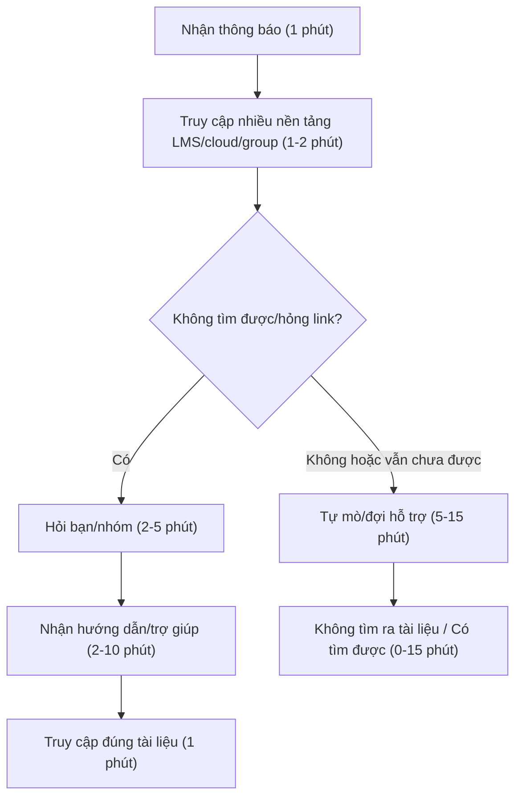
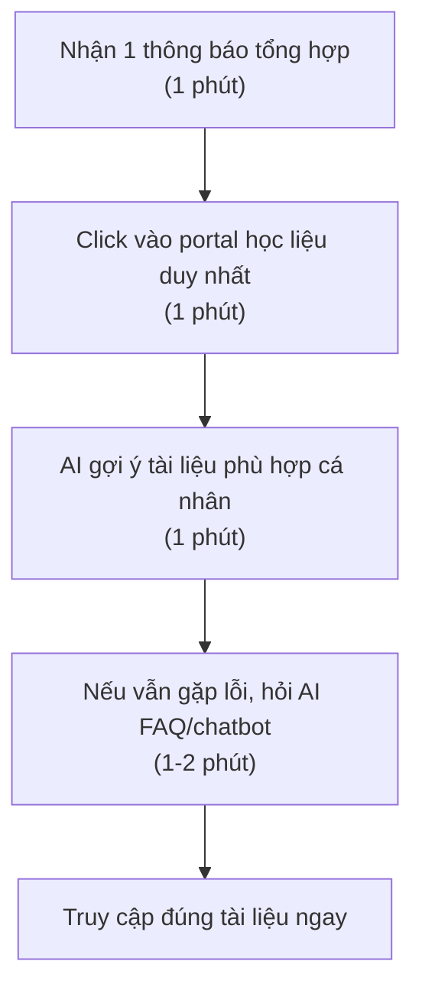

# 01 — Individual Problem Scan

## Scan rộng

Minh scan 10 problems, vượt mức tối thiểu 5.

| # | Lăng kính | Problem quan sát được | Ai đang đau? | Dấu hiệu thật |
|---|---|---|---|---|
| 1 | Pain từ người khác | Chưa làm quen với nền tảng mới, khó truy cập vào học liệu | Sinh viên mới | Nhiều bạn hỏi lại link/tài liệu, mất thời gian hỏi/gỡ lỗi/lọc nhiều nguồn |
| 2 | Tốn thời gian | Canteen quá đông | Tất cả sinh viên | Phải xếp hàng 15-20 phút mỗi giờ cao điểm, nhiều người than |
| 3 | Pain từ người khác | Thiếu trợ giảng/coach nên giải đáp, hỗ trợ không kịp thời hoặc quá tải | Sinh viên | Khi nhiều bạn cùng cần hỏi/lỗi, số lượng trợ giảng ít, phải chờ lâu mới được giúp; nhiều lúc trợ giảng bận/hết ca; nhiều vấn đề phải tự tìm cách giải quyết khiến tiến độ làm bài/lab bị ảnh hưởng |
| 4 | AI có thể tốt hơn / Lặp lại | Diễn giải chi tiết các assignment | Sinh viên, trợ giảng | Nhiều bạn cần giải thích kỹ lặp lại, tốn thời gian mỗi kỳ |
| 5 | Pain từ người khác | Chưa có kênh thống nhât, chính thức để kết nối sinh viên | Sinh viên | Chủ yếu kết nối qua group tự phát, thông tin phân tán, khó tìm bạn cùng lớp, cùng mối quan tâm |
| 6 | Pain từ người khác / AI có thể tốt hơn | Nhắc nhở deadline chưa hiệu quả, dễ bỏ lỡ bài nộp | Sinh viên | Có trường hợp bị trừ điểm hoặc xin nộp muộn do quên, thông báo bị trôi giữa kênh |
| 7 | Pain từ người khác / AI có thể tốt hơn | Giao diện hệ thống học tập/điểm danh/phản hồi chưa thân thiện | Sinh viên, nhất là ít dùng công nghệ | Nhiều bạn thao tác sai, gặp lỗi, phải hỏi hướng dẫn hoặc gửi sai/không biết feedback |

## Top 3

| Rank | Problem | Vì sao chọn | Điều còn chưa chắc |
|---|---|---|---|
| 1 | Chưa làm quen với nền tảng mới, khó truy cập vào học liệu | Nhiều người đau | Có thể một phần do cá nhân chủ động chưa đủ, hoặc đã có tài liệu nhưng trình bày/phân phối chưa hợp lý |
| 2 | Thiếu trợ giảng/coach nên giải đáp, hỗ trợ không kịp thời hoặc quá tải | Vấn đề này lặp lại nhiều, nhiều người đau | Quality improvement khó đo |
| 3 | Nhắc nhở deadline chưa hiệu quả, dễ bỏ lỡ bài nộp | Ảnh hưởng trực tiếp đến điểm số của sinh viên, quan trọng | Vấn đề phổ biến tới mức nào còn tùy từng lớp |

### Problem 1 câu:
Sinh viên mới chưa làm quen với nền tảng, khó truy cập học liệu.

Actor:
Sinh viên mới nhập học

Thời điểm / bối cảnh:
Tuần đầu nhập học; khi nhận thông báo/tài liệu từ nhiều kênh

Current workflow 3-7 bước:
1. Nhận thông báo hoặc link tài liệu từ email/LMS/group chat.
2. Cố gắng truy cập các nền tảng khác nhau (LMS, cloud, group).
3. Nếu không tìm được đúng file hoặc bị lỗi, hỏi lại bạn bè/trao đổi nhóm.
4. Thử các link khác hoặc hỏi trợ giảng/thầy cô.
5. Đợi hỗ trợ, hoặc tự bỏ qua/không sử dụng tài liệu đó.

Bottleneck:
Thao tác tìm kiếm và truy cập đúng tài liệu (nhiều nguồn, dễ nhầm/lẫn)

Impact:
Mất thời gian, dễ bị thiếu tài liệu, chậm tiến độ học hoặc lỡ kiến thức quan trọng

Success metric:
- Giảm số lần/lượt hỏi lại hoặc nhờ trợ giúp về tài liệu
- Thời gian trung bình để truy cập đúng tài liệu < 5 phút
- 100% sinh viên lấy được đủ tài liệu đúng thời hạn

Non-AI alternative:
Chuẩn hóa 1 kênh tài liệu, hướng dẫn tập trung khi nhập học, checklist in giấy

AI hypothesis:
Dùng AI tìm kiếm/lọc học liệu theo truy vấn tự nhiên; AI gợi ý tài liệu phù hợp cho từng môn/học sinh

Quick gut:
[ ] No AI / process fix  
[ ] Rule  
[X] Workflow  
[ ] Agent  
[ ] Chưa biết  

### Draft current workflow



### Draft future workflow



### Problem 2 câu:
Thiếu trợ giảng/coach nên giải đáp, hỗ trợ không kịp thời hoặc quá tải

Actor:
Sinh viên trong giờ học, làm lab, làm assignment

Thời điểm / bối cảnh:
Các phiên thực hành/lab, cao điểm deadline hoặc khi nhiều bạn gặp lỗi cùng lúc

Current workflow 3-7 bước:
1. Sinh viên làm bài/lab, assignment
2. Khi gặp vấn đề thì hỏi trợ giảng/coach hoặc group chat hỗ trợ
3. Chờ trợ giảng tới hỗ trợ trực tiếp hoặc nhắn trả lời
4. Nếu đông người hỏi cùng lúc thì phải tự mò hoặc chờ lâu
5. Nhiều lỗi nhỏ không được giải đáp kịp thời, ảnh hưởng đến tiến độ chung

Bottleneck:
Coach/trợ giảng không đủ, thời gian chờ hỗ trợ quá lâu

Impact:
- Dễ nản/gián đoạn học tập
- Sản phẩm/bài làm kém chất lượng
- Ảnh hưởng tinh thần và kết quả nhóm

Success metric:
- Tăng số lượt được giải đáp trực tiếp < 5 phút/lần hỏi
- Giảm tỷ lệ lỗi không được giải quyết trong buổi lab
- Sinh viên hài lòng với tốc độ hỗ trợ

Non-AI alternative:
Bố trí thêm trợ giảng/coach, chia ca trực rõ ràng, chuẩn hóa tài liệu FAQ

AI hypothesis:
AI assistant/FAQ tự động giải đáp các lỗi phổ biến, phân loại câu hỏi tự động, đề xuất hướng giải quyết real-time

Quick gut:
[ ] No AI / process fix  
[ ] Rule  
[ ] Workflow  
[X] Agent  
[ ] Chưa biết  

### Draft current workflow

```text
CURRENT WORKFLOW (Tổng: ~10-30 phút)

[Sinh viên làm lab/assignment] (Thời gian làm tuỳ bài)
         ↓
[Phát sinh vấn đề/lỗi] (—)
         ↓
[Hỏi trợ giảng/coach, nhắn group] (1 phút)
         ↓
    /               \
[Hỏi khi vắng/bận] (chờ 10–20 phút)  [Được giúp kịp] (2-5 phút)
  ↓                                   ↓
[Tự mò hoặc chờ lâu] (10–20 phút)  [Giải quyết nhanh] (1–2 phút)
  ↓
[Tiến độ bị ảnh hưởng]
```

### Draft future workflow

```text
FUTURE STATE (Tổng: ~2-6 phút)

[Sinh viên làm lab/assignment]
         ↓
[Gặp lỗi/thắc mắc]
         ↓
[Hỏi AI trợ lý (FAQ/bot hỗ trợ real-time)] (1 phút )
         ↓
/                       \
[AI giải quyết được] (1–2 phút)      [Câu hỏi phức tạp/ngoài danh mục]
          ↓                         ↓
     [Xử lý xong]                 [Trao cho trợ giảng/coach, ưu tiên] (3-5 phút)
          ↓                         ↓
    [Tiếp tục học/làm]            [Giải đáp nhanh cho các case đặc biệt]
```

### Problem 3 câu:
Nhắc nhở deadline chưa hiệu quả, dễ bỏ lỡ bài nộp

Actor:
Sinh viên các lớp có nhiều deadline song song

Thời điểm / bối cảnh:
Trong học kỳ có nhiều assignment/milestone, thông báo trên nhiều nền tảng

Current workflow 3-7 bước:
1. Nhận thông báo deadline qua nhiều kênh khác nhau (mail, LMS, chat group)
2. Tự ghi vào sổ tay/app lịch hoặc chỉ nhớ trong đầu
3. Quá tải thông tin hoặc quên deadline vì thông báo bị trôi
4. Đến gần deadline hoặc quá hạn mới phát hiện
5. Xin gia hạn/nộp muộn hoặc bị trừ điểm

Bottleneck:
Không có hệ thống nhắc việc tập trung, dễ sót/thừa quá nhiều thông báo

Impact:
- Tỉ lệ nộp muộn tăng
- Lo lắng căng thẳng cho sinh viên
- Ảnh hưởng điểm số và đánh giá

Success metric:
- Giảm tỉ lệ sinh viên nộp muộn xuống <5%
- Sinh viên tự tin quản lý deadline, biết trước ít nhất 24h
- Thông báo tập trung, dễ theo dõi

Non-AI alternative:
Tập trung thông báo vào 1 kênh duy nhất, dán lịch ở phòng học, checklist giấy

AI hypothesis:
AI nhắc lịch thông minh tích hợp đa kênh, tự động tổng hợp và push nhắc trước deadline phù hợp bài từng cá nhân

Quick gut:
[ ] No AI / process fix  
[ ] Rule  
[X] Workflow  
[ ] Agent  
[ ] Chưa biết  

### Draft current workflow

```text
CURRENT WORKFLOW (Tổng: ~5-10 phút mỗi môn/tuần, nhưng dễ lỡ hạn)

[Nhận thông báo từ nhiều kênh] (2 phút)
      ↓
[Tự ghi lại hoặc nhớ trong đầu] (3 phút)
      ↓
[Thông báo bị trôi/quá tải]
      ↓
[Quên hoặc lỡ deadline] (mất thời gian xin lại/quản lý điểm)
      ↓
[Phải xin nộp muộn hoặc bị trừ điểm]
```

### Draft future workflow

```text
FUTURE STATE (Tổng: ~2 phút/môn mỗi tuần, rất khó lỡ hạn)

[Hệ thống deadline tập trung tự động] (—)
          ↓
[AI tổng hợp & gửi nhắc riêng] (tự động, 0 phút sinh viên thao tác)
          ↓
[Nhắc trước deadline (1-3 ngày) + hôm hạn chót] (30 giây xác nhận)
          ↓
[Sinh viên nhận thông báo, xác nhận đã xem] (1 phút)
          ↓
[Điền bài/nộp đúng hạn, nhắc lại nếu thiếu] (1 phút nộp)
---